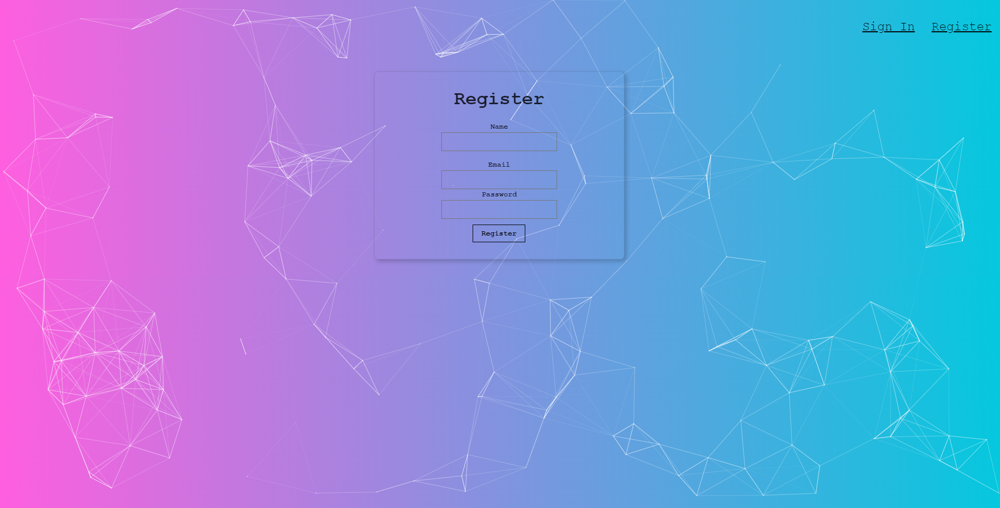

# Face Recognition - React Web Application (just the frontend)

This project was bootstrapped with [Create React App](https://github.com/facebook/create-react-app).

## Concepts
- React/JS/CSS/HTML
- Clarifai AI API Access - https://www.clarifai.com/models/face-detection

## User Experience
- sign in / sign out, register 
- takes the image given by URL and highlights the face

 ## Demo:
  User Interface:
  
  - register
  - 
  - home
  - 
  - face detected
  - 
